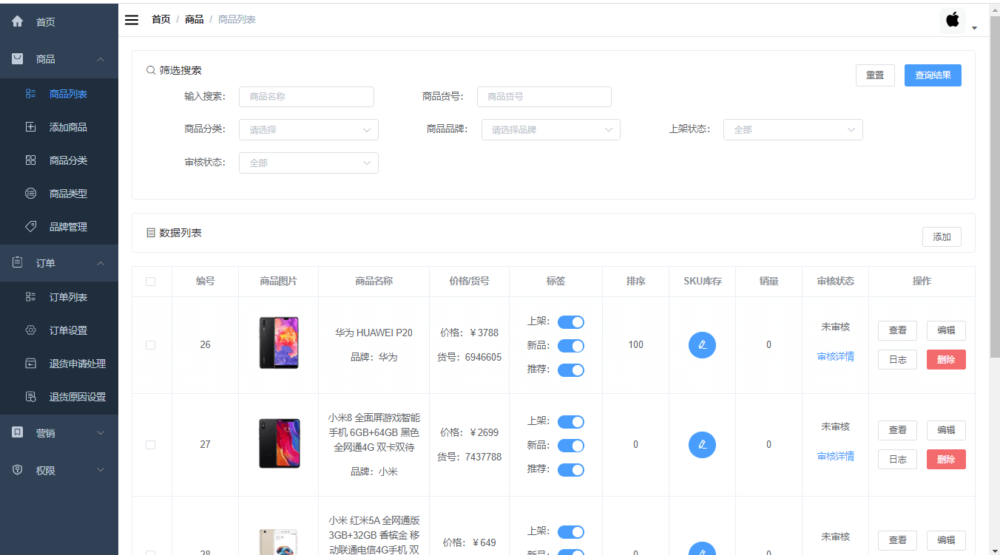
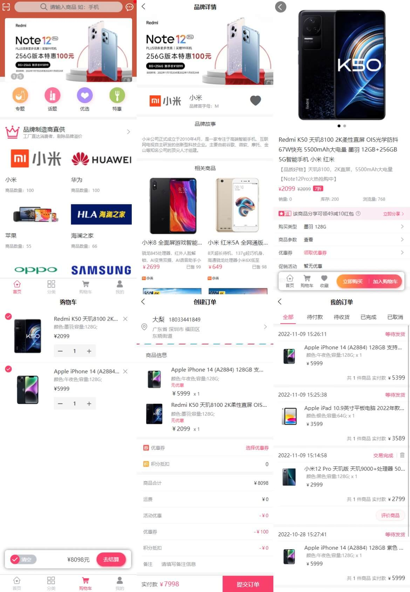
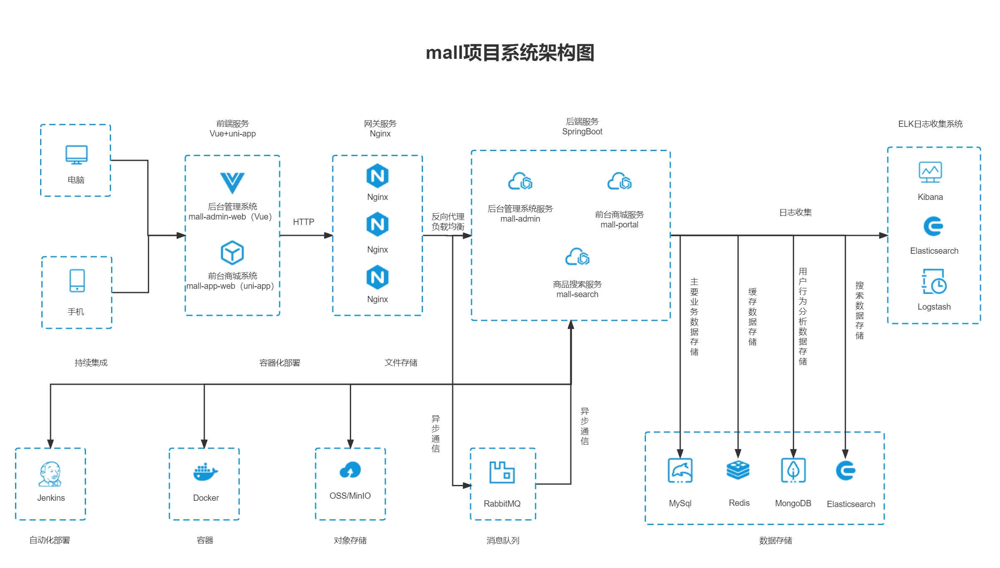
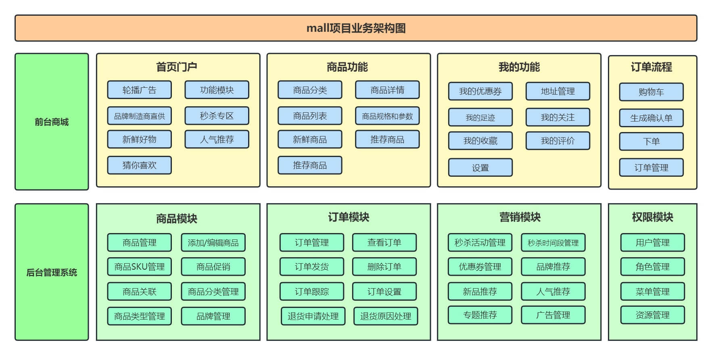
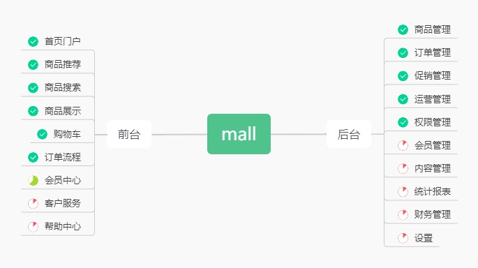

# mall

<p>
  <a href="#公众号"></a>
  <a href="#公众号"></a>
  <a href="https://github.com/macrozheng/mall-learning"></a>
  <a href="https://github.com/macrozheng/mall-swarm"></a>
  <a href="https://github.com/macrozheng/mall-admin-web"></a>
  <a href="https://github.com/macrozheng/mall-app-web"></a>
  <a href="https://gitee.com/macrozheng/mall"></a>
</p>

## 友情提示

> 1. **快速体验项目**：[在线访问地址](https://www.macrozheng.com/admin/index.html) 。
> 2. **全套学习教程**：[《mall学习教程》](https://www.macrozheng.com) 。
> 3. **视频教程（最新版）**：[《mall视频教程》](https://www.macrozheng.com/mall/foreword/mall_video.html) 。
> 4. **微服务版本**：基于Spring Cloud Alibaba的项目：[mall-swarm](https://github.com/macrozheng/mall-swarm) 。
> 5. **分支说明**：`master`分支基于Spring Boot 2.7+JDK 8，`dev-v3`分支基于Spring Boot 3.2+JDK 17。

## 前言

`mall`项目致力于打造一个完整的电商系统，采用现阶段主流技术实现。

## 项目文档

文档地址：[https://www.macrozheng.com](https://www.macrozheng.com)

## 项目介绍

`mall`项目是一套电商系统，包括前台商城系统及后台管理系统，基于SpringBoot+MyBatis实现，采用Docker容器化部署。前台商城系统包含首页门户、商品推荐、商品搜索、商品展示、购物车、订单流程、会员中心、客户服务、帮助中心等模块。后台管理系统包含商品管理、订单管理、会员管理、促销管理、运营管理、内容管理、统计报表、财务管理、权限管理、设置等模块。

### 项目演示

#### 后台管理系统

前端项目`mall-admin-web`地址：https://github.com/macrozheng/mall-admin-web

项目演示地址： [https://www.macrozheng.com/admin/index.html](https://www.macrozheng.com/admin/index.html)  



#### 前台商城系统

前端项目`mall-app-web`地址：https://github.com/macrozheng/mall-app-web

项目演示地址（将浏览器切换为手机模式效果更佳）：[https://www.macrozheng.com/app/](https://www.macrozheng.com/app/)



### 组织结构

``` lua
mall
├── mall-common -- 工具类及通用代码
├── mall-mbg -- MyBatisGenerator生成的数据库操作代码
├── mall-security -- SpringSecurity封装公用模块
├── mall-admin -- 后台商城管理系统接口
├── mall-search -- 基于Elasticsearch的商品搜索系统
├── mall-portal -- 前台商城系统接口
└── mall-demo -- 框架搭建时的测试代码
```

### 技术选型

#### 后端技术

| 技术                 | 说明                | 官网                                           |
| -------------------- | ------------------- | ---------------------------------------------- |
| SpringBoot           | Web应用开发框架      | https://spring.io/projects/spring-boot         |
| SpringSecurity       | 认证和授权框架      | https://spring.io/projects/spring-security     |
| MyBatis              | ORM框架             | http://www.mybatis.org/mybatis-3/zh/index.html |
| MyBatisGenerator     | 数据层代码生成器     | http://www.mybatis.org/generator/index.html    |
| Elasticsearch        | 搜索引擎            | https://github.com/elastic/elasticsearch       |
| RabbitMQ             | 消息队列            | https://www.rabbitmq.com/                      |
| Redis                | 内存数据存储         | https://redis.io/                              |
| MongoDB              | NoSql数据库         | https://www.mongodb.com                        |
| LogStash             | 日志收集工具        | https://github.com/elastic/logstash            |
| Kibana               | 日志可视化查看工具  | https://github.com/elastic/kibana              |
| Nginx                | 静态资源服务器      | https://www.nginx.com/                         |
| Docker               | 应用容器引擎        | https://www.docker.com                         |
| Jenkins              | 自动化部署工具      | https://github.com/jenkinsci/jenkins           |
| Druid                | 数据库连接池        | https://github.com/alibaba/druid               |
| OSS                  | 对象存储            | https://github.com/aliyun/aliyun-oss-java-sdk  |
| MinIO                | 对象存储            | https://github.com/minio/minio                 |
| JWT                  | JWT登录支持         | https://github.com/jwtk/jjwt                   |
| Lombok               | Java语言增强库      | https://github.com/rzwitserloot/lombok         |
| Hutool               | Java工具类库        | https://github.com/looly/hutool                |
| PageHelper           | MyBatis物理分页插件 | http://git.oschina.net/free/Mybatis_PageHelper |
| Swagger-UI           | API文档生成工具      | https://github.com/swagger-api/swagger-ui      |
| Hibernator-Validator | 验证框架            | http://hibernate.org/validator                 |

#### 前端技术

| 技术       | 说明                  | 官网                                   |
| ---------- | --------------------- | -------------------------------------- |
| Vue        | 前端框架              | https://vuejs.org/                     |
| Vue-router | 路由框架              | https://router.vuejs.org/              |
| Vuex       | 全局状态管理框架      | https://vuex.vuejs.org/                |
| Element    | 前端UI框架            | https://element.eleme.io               |
| Axios      | 前端HTTP框架          | https://github.com/axios/axios         |
| v-charts   | 基于Echarts的图表框架 | https://v-charts.js.org/               |
| Js-cookie  | cookie管理工具        | https://github.com/js-cookie/js-cookie |
| nprogress  | 进度条控件            | https://github.com/rstacruz/nprogress  |

#### 移动端技术

| 技术         | 说明             | 官网                                    |
| ------------ | ---------------- | --------------------------------------- |
| Vue          | 核心前端框架     | https://vuejs.org                       |
| Vuex         | 全局状态管理框架 | https://vuex.vuejs.org                  |
| uni-app      | 移动端前端框架   | https://uniapp.dcloud.io                |
| mix-mall     | 电商项目模板     | https://ext.dcloud.net.cn/plugin?id=200 |
| luch-request | HTTP请求框架     | https://github.com/lei-mu/luch-request  |

#### 架构图

##### 系统架构图



##### 业务架构图



#### 模块介绍

##### 后台管理系统 `mall-admin`

- 商品管理：[功能结构图-商品.jpg](document/resource/mind_product.jpg)
- 订单管理：[功能结构图-订单.jpg](document/resource/mind_order.jpg)
- 促销管理：[功能结构图-促销.jpg](document/resource/mind_sale.jpg)
- 内容管理：[功能结构图-内容.jpg](document/resource/mind_content.jpg)
- 用户管理：[功能结构图-用户.jpg](document/resource/mind_member.jpg)

##### 前台商城系统 `mall-portal`

[功能结构图-前台.jpg](document/resource/mind_portal.jpg)

#### 开发进度



## 环境搭建

### 开发工具

| 工具          | 说明                | 官网                                            |
| ------------- | ------------------- | ----------------------------------------------- |
| IDEA          | 开发IDE             | https://www.jetbrains.com/idea/download         |
| RedisDesktop  | redis客户端连接工具 | https://github.com/qishibo/AnotherRedisDesktopManager  |
| Robomongo     | mongo客户端连接工具 | https://robomongo.org/download                  |
| SwitchHosts   | 本地host管理        | https://oldj.github.io/SwitchHosts/             |
| X-shell       | Linux远程连接工具   | http://www.netsarang.com/download/software.html |
| Navicat       | 数据库连接工具      | http://www.formysql.com/xiazai.html             |
| PowerDesigner | 数据库设计工具      | http://powerdesigner.de/                        |
| Axure         | 原型设计工具        | https://www.axure.com/                          |
| MindMaster    | 思维导图设计工具    | http://www.edrawsoft.cn/mindmaster              |
| ScreenToGif   | gif录制工具         | https://www.screentogif.com/                    |
| ProcessOn     | 流程图绘制工具      | https://www.processon.com/                      |
| PicPick       | 图片处理工具        | https://picpick.app/zh/                         |
| Snipaste      | 屏幕截图工具        | https://www.snipaste.com/                       |
| Postman       | API接口调试工具      | https://www.postman.com/                        |
| Typora        | Markdown编辑器      | https://typora.io/                              |

### 开发环境

| 工具          | 版本号 | 下载                                                         |
| ------------- | ------ | ------------------------------------------------------------ |
| JDK           | 1.8    | https://www.oracle.com/technetwork/java/javase/downloads/jdk8-downloads-2133151.html |
| MySQL         | 5.7    | https://www.mysql.com/                                       |
| Redis         | 7.0    | https://redis.io/download                                    |
| MongoDB       | 5.0    | https://www.mongodb.com/download-center                      |
| RabbitMQ      | 3.10.5 | http://www.rabbitmq.com/download.html                        |
| Nginx         | 1.22   | http://nginx.org/en/download.html                            |
| Elasticsearch | 7.17.3 | https://www.elastic.co/downloads/elasticsearch               |
| Logstash      | 7.17.3 | https://www.elastic.co/cn/downloads/logstash                 |
| Kibana        | 7.17.3 | https://www.elastic.co/cn/downloads/kibana                   |

### 搭建步骤

> Windows环境部署

- Windows环境搭建请参考：[mall项目后端开发环境搭建](https://www.macrozheng.com/mall/start/mall_deploy_windows.html);
- 注意：如果只启动`mall-admin`模块，仅需安装MySQL、Redis即可;
- 克隆`mall-admin-web`项目，并导入到IDEA中完成编译：[前端项目地址](https://github.com/macrozheng/mall-admin-web);
- `mall-admin-web`项目的安装及部署请参考：[mall项目前端发环境搭建](https://www.macrozheng.com/mall/start/mall_deploy_web.html) 。

> Docker环境部署

- 使用虚拟机安装CentOS7.6请参考：[虚拟机安装及使用Linux，看这一篇就够了](https://www.macrozheng.com/mall/deploy/linux_install.html);
- 本项目Docker镜像构建请参考：[使用Maven插件为SpringBoot应用构建Docker镜像](https://www.macrozheng.com/project/maven_docker_fabric8.html);
- 本项目在Docker容器下的部署请参考：[mall在Linux环境下的部署（基于Docker容器）](https://www.macrozheng.com/mall/deploy/mall_deploy_docker.html);
- 本项目使用Docker Compose请参考： [mall在Linux环境下的部署（基于Docker Compose）](https://www.macrozheng.com/mall/deploy/mall_deploy_docker_compose.html);
- 本项目在Linux下的自动化部署请参考：[mall在Linux环境下的自动化部署（基于Jenkins）](https://www.macrozheng.com/mall/deploy/mall_deploy_jenkins.html);

## 公众号

加微信群交流，关注公众号「**macrozheng**」，回复「**加群**」即可。


## 许可证

[Apache License 2.0](https://github.com/macrozheng/mall/blob/master/LICENSE)

Copyright (c) 2018-2025 macrozheng


# 商城后台管理系统

一套完整的商品管理后台系统，基于 Spring Boot + Vue 3 + Element Plus 构建。

## 📋 系统概述

本系统是一个功能完善的商城后台管理系统，主要用于商品信息的管理和维护。系统采用前后端分离架构，提供了完整的商品管理解决方案。

## 🏗️ 系统架构

### 后端技术栈
- **Spring Boot 2.7.5** - 核心框架
- **MyBatis** - ORM 框架
- **MySQL** - 数据库
- **Redis** - 缓存
- **JWT** - 认证授权
- **Swagger** - API 文档
- **Maven** - 依赖管理

### 前端技术栈
- **Vue 3** - 前端框架
- **Element Plus** - UI 组件库
- **Vue Router** - 路由管理
- **Pinia** - 状态管理
- **Axios** - HTTP 客户端
- **ECharts** - 数据可视化
- **Vite** - 构建工具

## 🚀 功能特性

### 1. 商品管理
- ✅ 商品列表展示（分页、搜索、筛选）
- ✅ 商品新增、编辑、删除
- ✅ 商品批量操作（上架、下架、删除）
- ✅ 商品状态管理（审核、推荐、新品）
- ✅ 商品图片管理
- ✅ SKU 库存管理

### 2. 分类管理
- ✅ 商品分类树形展示
- ✅ 分类增删改查
- ✅ 多级分类支持

### 3. 品牌管理
- ✅ 品牌信息管理
- ✅ 品牌图标上传

### 4. 属性管理
- ✅ 商品属性定义
- ✅ 属性分类管理
- ✅ 规格参数配置

### 5. 订单管理
- ✅ 订单列表查看
- ✅ 订单状态管理
- ✅ 退货申请处理

### 6. 营销管理
- ✅ 优惠券管理
- ✅ 限时购活动
- ✅ 首页推荐配置

### 7. 用户权限
- ✅ 管理员登录
- ✅ 角色权限管理
- ✅ 菜单权限控制

### 8. 数据统计
- ✅ 商品数据统计
- ✅ 销售趋势图表
- ✅ 实时数据监控

## 📁 项目结构

```
mall/
├── mall-admin/                 # 后台管理模块
│   ├── src/main/java/
│   │   └── com/macro/mall/
│   │       ├── controller/     # 控制器层
│   │       ├── service/        # 服务层
│   │       ├── dao/           # 数据访问层
│   │       ├── dto/           # 数据传输对象
│   │       ├── bo/            # 业务对象
│   │       └── config/        # 配置类
│   └── src/main/resources/    # 配置文件
├── mall-common/               # 公共模块
├── mall-mbg/                  # MyBatis Generator
├── mall-security/             # 安全模块
├── mall-portal/               # 前台门户
├── mall-search/               # 搜索模块
└── mall-admin-frontend/       # 前端管理界面
    ├── src/
    │   ├── api/              # API 接口
    │   ├── components/       # 公共组件
    │   ├── layout/           # 布局组件
    │   ├── router/           # 路由配置
    │   ├── stores/           # 状态管理
    │   ├── styles/           # 样式文件
    │   └── views/            # 页面组件
    │       ├── dashboard/    # 仪表盘
    │       ├── login/        # 登录页
    │       ├── product/      # 商品管理
    │       └── order/        # 订单管理
    ├── package.json
    └── vite.config.js
```

## 🛠️ 快速开始

### 环境要求
- JDK 1.8+
- Maven 3.6+
- MySQL 5.7+
- Redis 3.0+
- Node.js 16+

### 后端启动

1. **克隆项目**
```bash
git clone <repository-url>
cd mall
```

2. **配置数据库**
```bash
# 创建数据库
mysql -u root -p
CREATE DATABASE mall DEFAULT CHARACTER SET utf8mb4;

# 导入数据库结构和数据
# 请在 document/sql 目录下找到相应的 SQL 文件
```

3. **修改配置**
```yaml
# 编辑 mall-admin/src/main/resources/application-dev.yml
spring:
  datasource:
    url: jdbc:mysql://localhost:3306/mall?useUnicode=true&characterEncoding=utf-8&serverTimezone=Asia/Shanghai
    username: your_username
    password: your_password
```

4. **启动服务**
```bash
# 编译项目
mvn clean install

# 启动后台管理服务
cd mall-admin
mvn spring-boot:run
```

后端服务将在 `http://localhost:8080` 启动

### 前端启动

1. **安装依赖**
```bash
cd mall-admin-frontend
npm install
```

2. **启动开发服务器**
```bash
npm run dev
```

前端服务将在 `http://localhost:3000` 启动

### 默认账号
- 用户名：`admin`
- 密码：`123456`

## 📱 系统截图

### 登录页面
- 简洁现代的登录界面
- 响应式设计，支持多设备访问

### 仪表盘
- 数据统计卡片展示
- 销售趋势图表
- 商品分类占比
- 最新商品和热销商品列表

### 商品列表
- 多条件搜索筛选
- 表格形式展示商品信息
- 批量操作功能
- 分页和排序

### 商品编辑
- 丰富的表单组件
- 图片上传功能
- 富文本编辑器
- 规格参数配置

## 🔧 核心功能说明

### 1. 商品管理
商品管理是系统的核心功能，包括：

**商品列表**
- 支持按商品名称、货号、分类、品牌等条件筛选
- 表格展示商品图片、名称、价格、库存、销量等信息
- 支持批量上架、下架、删除操作
- 实时切换商品上架状态

**商品编辑**
- 基本信息：名称、副标题、描述、货号等
- 价格库存：价格、库存数量、销量等
- 商品图片：主图和轮播图上传
- 规格参数：SKU 管理和属性配置
- 营销设置：是否推荐、新品、热销等

### 2. 分类管理
- 树形结构展示商品分类
- 支持多级分类
- 分类图标和描述管理

### 3. 品牌管理
- 品牌信息的增删改查
- 品牌 Logo 上传
- 品牌故事和描述

### 4. 用户权限
- 基于 JWT 的认证机制
- 角色和权限管理
- 菜单级别的权限控制

## 🚀 部署说明

### Docker 部署

1. **构建镜像**
```bash
# 后端
mvn clean package docker:build

# 前端
docker build -t mall-admin-frontend .
```

2. **运行容器**
```bash
docker-compose up -d
```

### 生产环境配置
- 数据库连接池优化
- Redis 缓存配置
- 日志级别调整
- 文件上传路径配置

## 📖 API 文档

启动后端服务后，可通过以下地址访问 API 文档：
- Swagger UI: `http://localhost:8080/swagger-ui/`

主要 API 接口：
- `GET /product/list` - 获取商品列表
- `POST /product/create` - 创建商品
- `POST /product/update/{id}` - 更新商品
- `POST /product/update/publishStatus` - 批量上下架
- `GET /product/updateInfo/{id}` - 获取商品编辑信息

## 🤝 贡献指南

1. Fork 本仓库
2. 创建您的功能分支 (`git checkout -b feature/AmazingFeature`)
3. 提交您的更改 (`git commit -m 'Add some AmazingFeature'`)
4. 推送到分支 (`git push origin feature/AmazingFeature`)
5. 打开一个 Pull Request

## 📄 许可证

本项目采用 MIT 许可证 - 查看 [LICENSE](LICENSE) 文件了解详情

## 📞 联系我们

如有问题或建议，请通过以下方式联系：
- 提交 Issue
- 发送邮件
- 加入交流群

## 🎯 路线图

- [ ] 商品导入导出功能
- [ ] 商品评价管理
- [ ] 库存预警功能
- [ ] 数据报表导出
- [ ] 移动端适配
- [ ] 多语言支持

---

**感谢您使用商城后台管理系统！** 🎉
